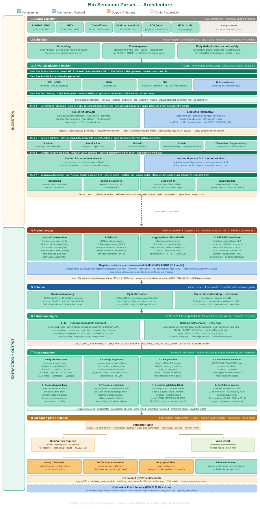

# Bio-Semantic Parser

**Bio-Semantic Parser** is a biomedical knowledge graph construction pipeline built at Rejuve.Bio / SingularityNET. It reads scientific papers from multiple sources — PubMed, PMC, GEO, ClinicalTrials.gov, bioRxiv, medRxiv, PDFs, and any URL — and extracts structured biological relations into a Neo4j graph database and a MeTTa/Hyperon AtomSpace.

---

## Quick Start

```bash
cd bio-semantic-parser
docker compose up -d --build
```

The web UI will be available at **http://localhost:8020** once the containers are healthy.  
The API runs on port **8024** internally (proxied through nginx).

> **First run only:** the entrypoint script downloads NLP models (scispaCy, HuggingFace NER, GLiNER) into the Docker volume cache. This takes a few minutes. Watch progress with:
> ```bash
> docker logs deploy-api-1 -f
> ```

---

## What it does

Takes a paper identifier or file as input and produces:

- **Neo4j knowledge graph** — nodes and edges as CSV + Cypher import files
- **MeTTa AtomSpace** — structured biological triples with probabilistic truth values
- **Interactive graph** — `graph.html` per run, rendered with vis.js
- **Verification reports** — per-triple source verification and confidence breakdown
- **Human review queue** — flagged triples surfaced in the UI for biologist approval

---

## Pipeline — 8 Layers

| Layer | Name | What it does |
|---|---|---|
| 1 | **Source Registry** | YAML-configured sources — PubMed, PMC, GEO, ClinicalTrials.gov, bioRxiv, medRxiv, PDF, HTML/URL. Add a new source with one YAML entry, no code change. |
| 2 | **Scheduler** | Weekly trigger per source, SHA-256 / standard ID deduplication, crash-safe (ID written before dispatch) |
| 3 | **Fetcher** | 7 steps: format detection → raw fetch → text cleaning → coreference resolution → section splitting → context-window chunking → metadata attachment |
| 4 | **Pre-Extraction** | 4-tagger NER ensemble (scispaCy × 5, PubTator3, HuggingFace clinical NER, GLiNER-BioMed) + NLI negation detector |
| 5 | **Schema** | 96 relation types × 85 entity types — closed taxonomy, Pydantic model, Instructor constrained decoding |
| 6 | **Extraction Engine** | Local LLM (OpenAI-compatible) with leaky-bucket concurrency, mandatory reasoning trace, Pydantic retry loop (max 3) |
| 7 | **Post-Extraction** | 8 steps: entity normalization → concept alignment → deduplication → contradiction detection → cross-chunk linking → two-pass resolution → semantic validation → confidence scoring |
| 8 | **Validation Gate + Publish** | Auto-insert or human review routing → Neo4j CSV writer + MeTTa writer + vis.js graph → unified triple store on commit |

---

## Running a Paper

1. Open **http://localhost:8020**
2. Enter a PMID, PMC ID, DOI, URL, or upload a PDF
3. Select output format: Neo4j, MeTTa, or both
4. Click **Run** — progress streams live over WebSocket

After the run completes, review extracted triples in the graph view, approve or reject flagged items in the human review queue, then click **Commit** to add the paper to the unified knowledge graph.

---

## NER Ensemble — Layer 4

Four taggers run on every chunk and their spans are merged before the LLM sees the text:

| Tagger | Model | Covers |
|---|---|---|
| scispaCy ensemble | 5 models: `en_core_sci_lg`, `bc5cdr`, `jnlpba`, `bionlp13cg`, `craft` | Genes, proteins, chemicals, diseases, cell lines |
| PubTator3 | NCBI annotation service (PubMed papers only) | Pre-canonical NCBI Gene + MeSH IDs, Priority 1 in entity normalization |
| HuggingFace clinical NER | `d4data/biomedical-ner-all` | PROCEDURE, DRUG, SYMPTOM, CLINICAL_MEASUREMENT — clinical types scispaCy misses |
| GLiNER-BioMed Base | `Ihor/gliner-biomed-base-v1.0` | 38 zero-shot label categories covering the full ~83-type schema (TADs, enhancers, motifs, epigenomics, 3D genome structures, etc.) |

Negation is detected by an NLI cross-encoder (`cross-encoder/nli-MiniLM2-L6-H768`) that isolates each entity's sub-clause at contrastive conjunctions and classifies contradiction probability.

---

## Entity Normalization — Layer 7, Step 1

11-priority resolver chain per entity mention:

| Priority | Source | ID format |
|---|---|---|
| 1 | PubTator3 (pre-annotated) | Various |
| 2 | Embedded ID patterns | `rs…`, `ENSG…`, `UniProtKB:…` |
| 3 | Ensembl REST API | `ENSEMBL:ENSG…` |
| 4 | UniProt | `UniProtKB:P…` |
| 5 | OLS4 / EBI (type-scoped) | `MONDO:`, `CHEBI:`, `HP:`, `GO:`, … |
| 6 | Context expansion (LLM abbreviation resolution) | — |
| 7 | Ensembl cross-reference via NCBI Gene | `ENSEMBL:ENSG…` |
| 8 | NCBI eSearch (gene, variant, taxonomy) | `NCBI_GENE:`, `rs…`, `NCBITaxon:` |
| 9 | OLS4 broad (no ontology filter) | Any prefix |
| 10 | Composite decomposition | — |
| 11 | Wikidata | `WD:Q…` |

Gene IDs resolve to **Ensembl by default** (team decision, aligns with BioCypher approach). NCBI Gene IDs are bridged back to Ensembl when found.

---

## Taxonomy — 96 Relation Types × 85 Entity Types

| Source | Contribution |
|---|---|
| Biolink Model v4.4.2 | Core predicate ontology |
| Hetionet v1.0 | Network medicine edge types |
| OpenBioLink | Large-scale KG benchmark types |
| BioNLP Shared Tasks | GE, EPI, BB task relation types |
| BioCypher primer | Regulatory and genomic edge types |
| Longevity extensions | `extends_lifespan`, `reduces_lifespan`, `extends_healthspan`, `reduces_healthspan`, `reprograms` |

The full taxonomy is defined in `src/schema/taxonomy.py` — single source of truth for the LLM prompt, Pydantic validation, contradiction detection, and graph output.

---

## Configuration

Key environment variables (set in `.env.docker`):

```bash
# LLM endpoint (OpenAI-compatible)
LLM_BASE_URL=http://your-ollama-or-vllm:11434/v1
LLM_MODEL=gemma2:27b
LLM_API_KEY=ollama

# Coreference resolution
COREF_SERVICE_URL=http://your-coref-server:8081

# NER toggles
HF_NER_ENABLED=true
GLINER_ENABLED=true

# Optional features
ENABLE_PLN=false
```

---

## Output Structure

```
data/
  kg_output/
    2026-07-01_10-50-04_PMID_12345678/    ← per-paper run (timestamped)
      neo4j/                              ← CSV + Cypher files per entity type
      metta/                              ← .metta files per entity type
      graph.html                          ← interactive vis.js graph
      verification_report.html            ← per-triple source verification
      compare_neo4j.html                  ← this paper vs unified KG diff
      human_review.jsonl                  ← flagged triples for approval
    unified_neo4j/                        ← all committed papers combined
    unified_metta/
  triple_store_neo4j.db                   ← unified SQLite store (Neo4j)
  triple_store_metta.db                   ← unified SQLite store (MeTTa)
  checkpoints/                            ← per-layer resumable checkpoints
  staging/                                ← per-run staging DBs (pre-commit)
```

---

## Tech Stack

| Component | Technology |
|---|---|
| LLM extraction | Any OpenAI-compatible endpoint (Ollama / vLLM) — default `gemma2:27b` |
| Schema validation | Pydantic + Instructor (constrained decoding) |
| NER | scispaCy (5 models) + HuggingFace `d4data/biomedical-ner-all` + GLiNER `Ihor/gliner-biomed-base-v1.0` |
| Entity annotation | PubTator3 (NCBI) |
| Negation detection | `cross-encoder/nli-MiniLM2-L6-H768` |
| Coreference resolution | s2e-coref / LingMess (external service) |
| Graph output | Neo4j CSV + MeTTa/Hyperon AtomSpace |
| Graph visualization | vis.js (rendered server-side) |
| API | FastAPI + WebSocket (live progress streaming) |
| Frontend | Nginx + vanilla JS single-page app |
| Infrastructure | Docker Compose (two services: `api`, `frontend`) |

---

## Architecture Diagram


